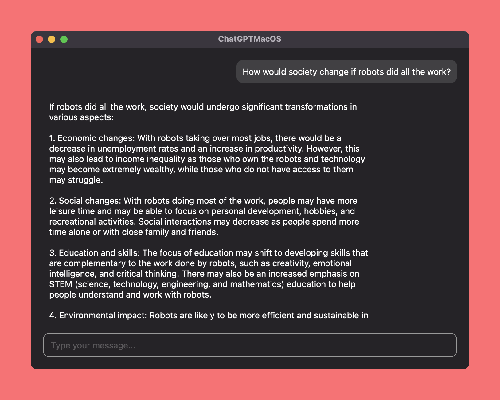

# chatgpt-macos

A React Native MacOS demo for ChatGPT client

## Preview



## Usage

Clone this repository.

```
git clone https://github.com/ozgrozer/chatgpt-macos.git
```

Install dependencies and initialize macos.

```
yarn install
npx react-native-macos-init
```

Start development.

```
# first terminal tab
yarn start
# second terminal tav
yarn macos
```

Build the app.

1. Open macos/ChatGPTMacOS.xcworkspace file.
2. Select the project name near the top left.
3. Then go to Product > Scheme > Edit Scheme.
4. Set the Run/Build Configuration to Release.
5. Build the app by Product > Build or just pressing CMD + B.
6. Right-click on the .app file in the Products group in the left sidebar, and select Show in Finder.
